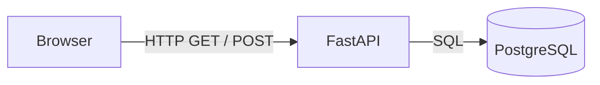
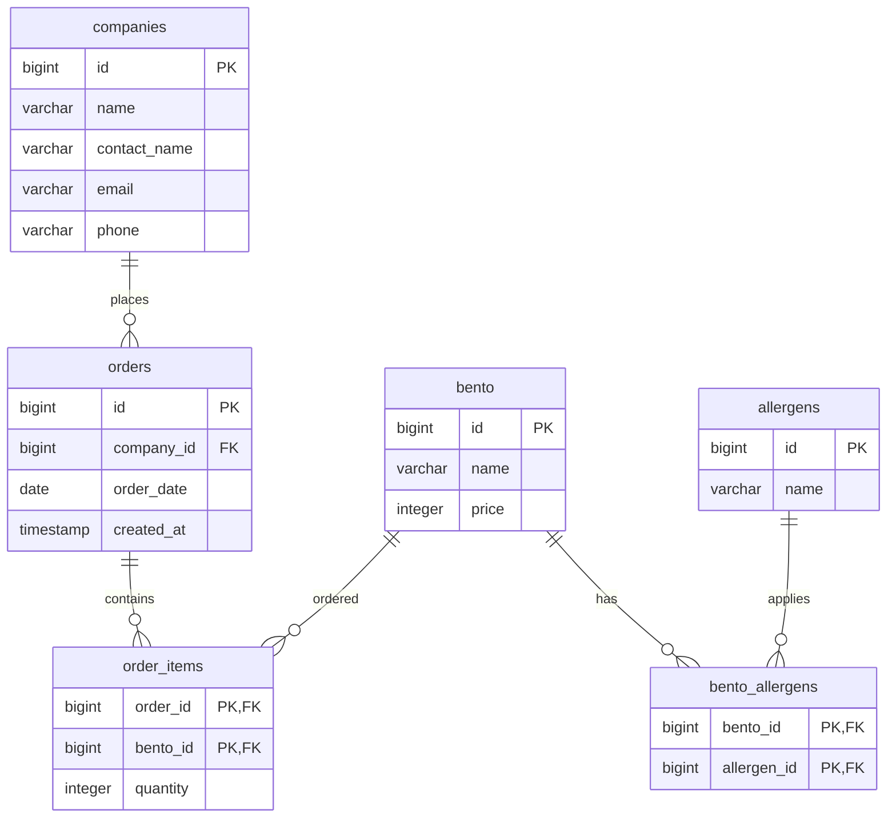
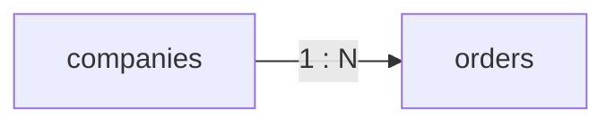
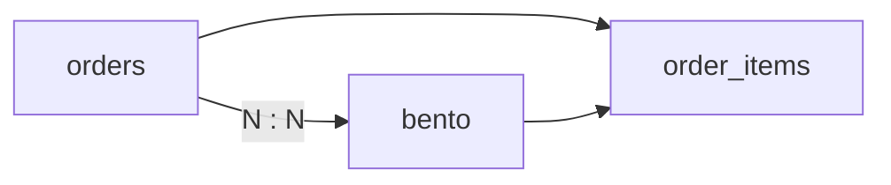
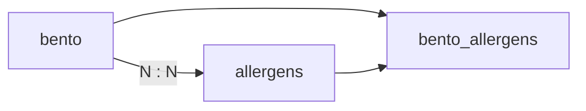
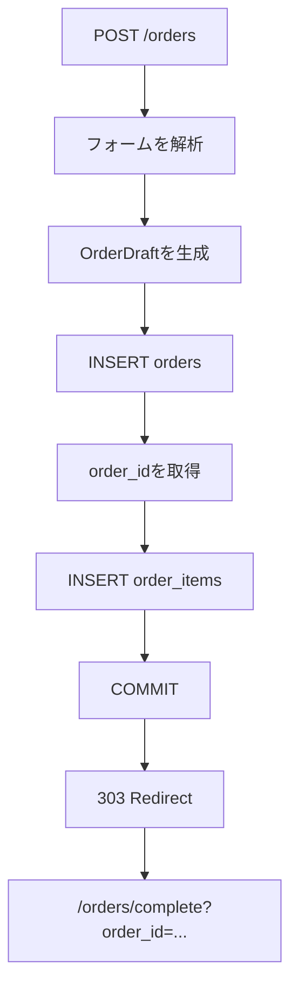
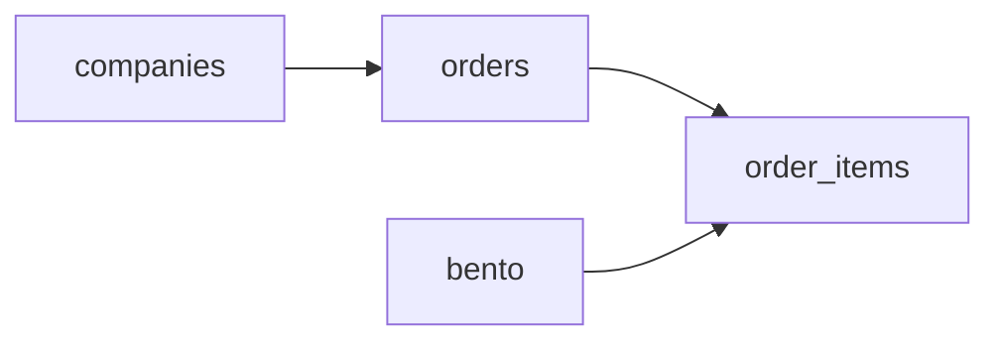
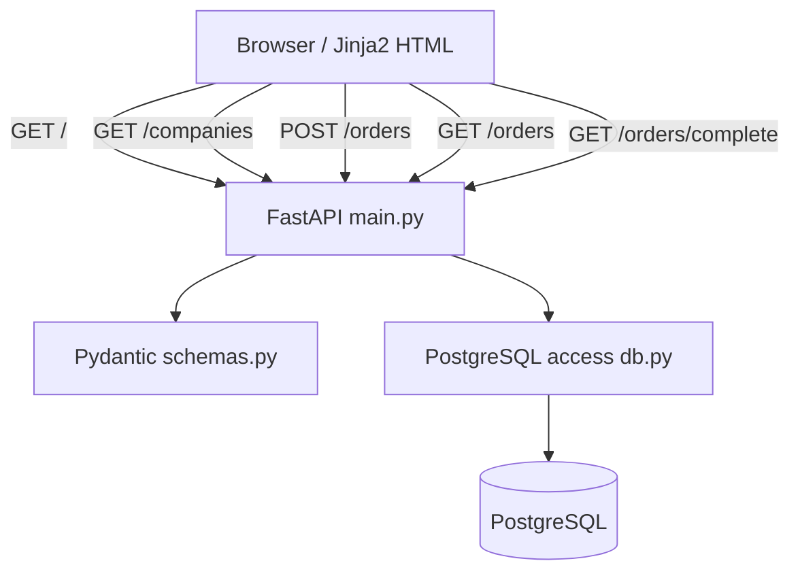
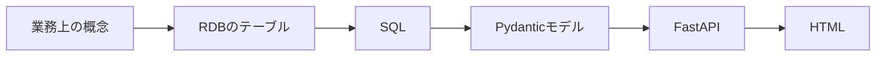

# FastAPI PostgreSQL Demo

このリポジトリは、以下の会話をもとに作成しました。

- 元の会話: https://chatgpt.com/share/6a94d0cb-e58c-83e8-96c3-8c5c622c78de

このアプリは、弁当の仕出し注文を題材にした業務用デモアプリです。

**FastAPI + PostgreSQL + HTML/Jinja2** というシンプルな構成で、RDBにおける1対多・多対多の関係と、Webアプリケーションからのデータ登録・取得を確認することを目的とします。

現在の実装では、**会社を選択して弁当を数量指定し、注文を登録する**ところまでを一連の画面として実装しています。また、登録した注文の履歴と、個別の注文完了画面、注文元会社の連絡先を確認する取引先一覧画面も提供しています。

> このデモの目的は、業務上のデータをどのようにRDBで表現し、FastAPIからSQLとPydanticモデルを通じて扱うかを、わかりやすい具体例として学ぶことです。会社・注文・弁当・アレルゲンの関係を、実際のWebフォームとデータベース処理を通じて確認できます。

---

## 1. システム構成



使用技術：

- Python
- FastAPI
- Uvicorn
- psycopg
- PostgreSQL
- Pydantic
- Jinja2

フロントエンドは**HTML/Jinja2を中心としたシンプルな構成**です。

ReactやVueなどのフロントエンドフレームワークは使用していません。

---

## 2. PostgreSQL

デフォルトの接続先は `demo_db` です。

`db.py` では、環境変数 `DATABASE_URL` が設定されている場合はそれを使用し、設定されていない場合は以下を使用します。

```text
dbname=demo_db
```

接続確認：

```bash
psql demo_db
```

本番環境などでは、例えば `DATABASE_URL` を設定して接続先を切り替えられます。

---

## 3. ディレクトリ構成

現在のPythonコードから確認できるアプリケーション構成は次のとおりです。

```text
fastapi-postgres-demo/
├── app/
│   ├── main.py
│   ├── db.py
│   ├── schemas.py
│   └── templates/
│       ├── index.html
│       ├── companies.html
│       ├── order_history.html
│       └── order_complete.html
├── tests/
│   └── test_orders_complete.py
├── .github/
│   └── workflows/
│       └── ci.yml          # CI（pre-commit と同じチェックを実行）
├── .pre-commit-config.yaml # チェック項目の唯一の定義
├── pyproject.toml          # 依存関係 + ruff / mypy / pytest の設定
├── uv.lock
├── .venv/
├── .gitignore
└── ...
```

`main.py` では `app/templates` をJinja2のテンプレートディレクトリとして使用しています。

---

## 4. データベーススキーマ

現在のアプリケーションで利用している主要なテーブルは以下です。



### 4.1 `companies`

注文元の会社を管理します。

| Column | Type | Constraint | Description |
|---|---|---|---|
| `id` | BIGSERIAL | PK | 会社ID |
| `name` | VARCHAR(200) | NOT NULL | 会社名 |
| `contact_name` | VARCHAR(100) | | 担当者名 |
| `email` | VARCHAR(255) | | メールアドレス |
| `phone` | VARCHAR(50) | | 電話番号 |

注文画面では、会社選択欄に表示するために `id` と `name` を取得しています。

```sql
SELECT id, name
FROM companies
ORDER BY name;
```

取引先一覧画面（`GET /companies`）では、担当者・連絡先を含めて取得し、あわせて会社ごとの注文実績を集計します。

```sql
SELECT
    c.id,
    c.name,
    c.contact_name,
    c.email,
    c.phone,
    COUNT(DISTINCT o.id) AS order_count,
    MAX(o.order_date) AS last_order_date,
    COALESCE(SUM(b.price * oi.quantity), 0) AS total_price
FROM companies c
LEFT JOIN orders o
    ON o.company_id = c.id
LEFT JOIN order_items oi
    ON oi.order_id = o.id
LEFT JOIN bento b
    ON b.id = oi.bento_id
GROUP BY c.id, c.name, c.contact_name, c.email, c.phone
ORDER BY c.name;
```

`contact_name`、`email`、`phone` はNULLを許容するため、Python側では `str | None` として扱い、未登録の場合は画面に「未登録」と表示します。

注文が1件もない会社も一覧に表示できるよう、`orders` 以降は `LEFT JOIN` で結合しています。

---

### 4.2 `orders`

1回の注文を管理します。

| Column | Type | Constraint | Description |
|---|---|---|---|
| `id` | BIGSERIAL | PK | 注文ID |
| `company_id` | BIGINT | FK | 注文元会社 |
| `order_date` | DATE | NOT NULL | 注文日 |
| `created_at` | TIMESTAMP | NOT NULL | 登録日時 |

関係：



1つの会社から複数の注文が発生します。

注文登録時には、`company_id`、`order_date`、`created_at` が登録されます。

`created_at` はSQL側で `NOW()` を使用して設定します。

---

### 4.3 `bento`

弁当マスタです。

| Column | Type | Constraint | Description |
|---|---|---|---|
| `id` | BIGSERIAL | PK | 弁当ID |
| `name` | VARCHAR(200) | NOT NULL | 弁当名 |
| `price` | INTEGER | NOT NULL | 価格 |

現在のPythonコードでは、注文画面に表示するために `id`、`name`、`price` を取得しています。

```sql
SELECT id, name, price
FROM bento
ORDER BY id;
```

価格は注文履歴・注文詳細画面の合計金額計算にも使用されます。

---

### 4.4 `order_items`

1つの注文に含まれる弁当と数量を管理します。

| Column | Type | Constraint | Description |
|---|---|---|---|
| `order_id` | BIGINT | PK, FK | 注文ID |
| `bento_id` | BIGINT | PK, FK | 弁当ID |
| `quantity` | INTEGER | NOT NULL | 数量 |

複合主キー：

```text
PRIMARY KEY (order_id, bento_id)
```

関係：



例えば、1つの注文に複数種類の弁当を含めることができます。

```text
注文ID 1
  ├── 唐揚げ弁当 × 10
  ├── 鮭弁当     × 5
  └── 幕の内弁当 × 3
```

注文登録時には、`orders` に注文ヘッダを登録した後、`order_items` に各弁当の数量を登録します。

---

### 4.5 `allergens`

アレルギー情報のマスタです。

| Column | Type | Constraint | Description |
|---|---|---|---|
| `id` | BIGSERIAL | PK | アレルギーID |
| `name` | VARCHAR(100) | NOT NULL, UNIQUE | アレルギー名 |

注文画面の食品アレルギー表で、弁当に含まれるアレルゲンの表示に利用しています。

---

### 4.6 `bento_allergens`

弁当とアレルギーの多対多関係を管理します。

| Column | Type | Constraint | Description |
|---|---|---|---|
| `bento_id` | BIGINT | PK, FK | 弁当ID |
| `allergen_id` | BIGINT | PK, FK | アレルギーID |

関係：



例えば、次のような関係を表現できます。

```text
唐揚げ弁当
  ├── 小麦
  ├── 卵
  └── 大豆
```

注文画面の食品アレルギー表で、弁当とアレルギーの関係を取得するために利用しています。

---

## 5. アプリケーションのデータモデル

Python側では、Pydanticを利用してデータモデルを定義しています。

モデルは `frozen=True` としており、生成後に変更できないイミュータブルなモデルとして扱います。

### `Company`

```text
id: int
name: str
```

### `CompanyContact`

```text
id: int
name: str
contact_name: str | None
email: str | None
phone: str | None
order_count: int
last_order_date: str | None
total_price: int
```

取引先一覧画面で使用する、会社の連絡先と注文実績です。

### `Bento`

```text
id: int
name: str
price: int
```

`price` は0以上です。

### `OrderSummary`

```text
id: int
order_date: str
company_name: str
total_price: int
```

注文履歴・注文完了画面で使用する注文の概要です。

### `OrderItem`

```text
name: str
quantity: int
price: int
subtotal: int
```

注文に含まれる弁当1種類分の明細です。

### `QuantitySelection`

```text
bento_id: int
quantity: int
```

フォームから受け取った「弁当IDと数量」の組を表します。

### `OrderDraft`

```text
company_id: int
order_date: str
quantities: tuple[QuantitySelection, ...]
```

注文登録前のデータを表します。

---

# 6. API / Route

現在のFastAPIアプリケーションでは、以下のRouteを提供しています。

| Method | Path | 内容 |
|---|---|---|
| GET | `/` | 注文登録画面 |
| GET | `/companies` | 取引先一覧 |
| POST | `/orders` | 注文登録 |
| GET | `/orders` | 注文履歴 |
| GET | `/orders/complete` | 注文完了・注文詳細 |

---

## 6.1 GET `/`

注文登録画面を表示します。

```http
GET /
```

FastAPIからテンプレートへ以下のデータを渡します。

```text
companies
bentos
```

`companies` は会社選択欄、`bentos` は弁当と価格・数量入力欄の生成に利用します。

画面右上の「取引先一覧」から `GET /companies` へ遷移できます。

---

## 6.2 GET `/companies`

取引先一覧画面を表示します。

```http
GET /companies
```

会社ごとに、

- 会社名
- 担当者名
- メールアドレス
- 電話番号
- 注文件数
- 最終注文日
- 累計金額

を表示します。

`companies.contact_name`、`companies.email`、`companies.phone` を利用する画面です。

メールアドレスは `mailto:`、電話番号は `tel:` リンクとして表示し、未登録の項目は「未登録」と表示します。

会社名・担当者・連絡先による絞り込みは、ブラウザ側のJavaScriptで行います。

---

## 6.3 POST `/orders`

注文を登録します。

```http
POST /orders
Content-Type: application/x-www-form-urlencoded
```

注文には、

- 注文元会社
- 注文日
- 1種類以上の弁当
- 各弁当の数量

が必要です。

### フォーム項目

```text
company_id
order_date
quantity_{bento.id}
```

例えば、

```text
company_id=1
order_date=2026-08-30
quantity_1=10
quantity_2=5
quantity_3=3
```

のようなフォームを受け取ります。

`quantity_N` の `N` は `bento.id` を表します。

FastAPI側では、`quantity_` を取り除いた文字列を整数に変換して弁当IDとして扱います。

数量が0以下の項目は注文対象から除外され、1つも正の数量が存在しない場合は400エラーになります。

---

## 6.4 注文登録の処理

注文登録は、注文ヘッダと注文明細を**同一トランザクション**で処理します。



`db.insert_order()` では、

1. `orders` に注文を登録
2. `RETURNING id` で注文IDを取得
3. `order_items` に各明細を登録
4. すべて成功したらコミット

という流れで処理します。

途中でエラーが発生した場合はトランザクション全体がロールバックされます。

したがって、

```text
orders
```

だけ登録されて、

```text
order_items
```

が登録されない状態を避ける設計になっています。

---

## 6.5 GET `/orders`

注文履歴を表示します。

```http
GET /orders
```

注文ごとに、

- 注文ID
- 注文日
- 会社名
- 合計金額

を取得します。

合計金額は、以下の関係からSQLで計算しています。

```text
bento.price × order_items.quantity
```

複数の明細がある場合は `SUM()` で合計します。

注文は、

```text
注文日 DESC
注文ID DESC
```

の順で表示されます。

---

## 6.6 GET `/orders/complete`

注文登録後の注文完了画面、および個別注文の詳細を表示します。

```http
GET /orders/complete?order_id=1
```

注文IDに対応する、

- 注文ID
- 注文日
- 会社名
- 合計金額
- 弁当名
- 数量
- 単価
- 小計

を取得します。

存在しない注文IDが指定された場合は `404 Not Found` を返します。

---

# 7. 注文履歴のデータ取得

注文履歴では、`orders`、`companies`、`order_items`、`bento` をJOINして注文情報を取得します。

概念的には次のような関係です。



注文の合計金額は、

```sql
SUM(b.price * oi.quantity)
```

によって計算します。

注文詳細では、明細ごとに、

```sql
b.price * oi.quantity
```

を小計として取得します。

---

# 8. HTMLとDBの対応

注文登録画面では、HTMLのフォーム項目とデータベースの列を次のように対応させています。

| HTML | Python | PostgreSQL |
|---|---|---|
| 会社選択 | `company_id` | `companies.id` |
| 注文日 | `order_date` | `orders.order_date` |
| 弁当 | `bento.id` | `bento.id` |
| 弁当名 | `bento.name` | `bento.name` |
| 価格 | `bento.price` | `bento.price` |
| 数量 | `quantity_{bento.id}` | `order_items.quantity` |
| 注文 | `POST /orders` | `orders` |
| 注文明細 | `POST /orders` | `order_items` |

取引先一覧画面では、次のように対応させています。

| HTML | Python | PostgreSQL |
|---|---|---|
| 会社名 | `company.name` | `companies.name` |
| 担当者 | `company.contact_name` | `companies.contact_name` |
| メール | `company.email` | `companies.email` |
| 電話 | `company.phone` | `companies.phone` |
| 注文件数 | `company.order_count` | `orders` の件数 |
| 最終注文日 | `company.last_order_date` | `MAX(orders.order_date)` |
| 累計金額 | `company.total_price` | `SUM(bento.price * order_items.quantity)` |

アレルギーについては、現在の画面・Python処理では未使用ですが、データベースには、

```text
allergens
bento_allergens
```

を含むスキーマを保持しています。

---

# 9. データベースアクセス

`app/db.py` がPostgreSQLへのアクセスを担当します。

主な関数：

| Function | 内容 |
|---|---|
| `get_connection()` | PostgreSQLへの接続を作成 |
| `fetch_companies()` | 会社一覧を取得 |
| `fetch_company_contacts()` | 会社の連絡先と注文実績を取得 |
| `fetch_bentos()` | 弁当一覧を取得 |
| `fetch_bento_allergens()` | 弁当ごとのアレルゲン一覧を取得 |
| `fetch_orders()` | 注文履歴を取得 |
| `fetch_order(order_id)` | 注文と明細を取得 |
| `insert_order(draft)` | 注文と明細を登録 |

ORMは使用せず、SQLを明示的に記述しています。

データベースから取得した行は、`Company`、`CompanyContact`、`Bento`、`OrderSummary`、`OrderItem` などのPydanticモデルへ変換します。

---

# 10. 起動

依存関係を同期：

```bash
uv sync
```

FastAPIを起動：

```bash
uv run uvicorn app.main:app --reload
```

ブラウザ：

```text
http://127.0.0.1:8000/
```

Swagger UI：

```text
http://127.0.0.1:8000/docs
```

なお、このアプリケーションの主要な画面はHTML/Jinja2による画面であり、Swagger UIはFastAPIが提供するAPIドキュメントです。

## 10.1 テストと静的解析

個別に実行する場合：

```bash
uv run ruff check .     # lint（select = ALL）
uv run ruff format .    # フォーマッタ
uv run mypy             # 型チェック（strict）
uv run pytest           # テスト
```

`mypy` に引数は渡しません。対象は `pyproject.toml` の `[tool.mypy] files` で `app` / `tests` と定義済みです。

テストは `db.get_connection` をフェイクの接続へ差し替えたうえで、FastAPIの `TestClient` から各ルートを呼び出します。SQLの結果行がPydanticモデルとテンプレートを通して正しく描画されるか、`parse_quantities` がフォームの値を正しく解釈するかを検証しており、**PostgreSQLが無くても実行できます**。

## 10.2 pre-commit フックとCI

チェック項目は `.pre-commit-config.yaml` に**一箇所だけ**定義し、ローカルのコミット時とCIの両方が同じ定義を実行します。

| | 実行方法 | 対象ファイル |
| --- | --- | --- |
| ローカル | `git commit` （フック経由） | ステージされたファイル |
| CI | `uv run pre-commit run --all-files` | リポジトリ全体 |

CIだけが厳しい／ローカルだけが厳しい、という状態が原理的に起こりません。チェックを追加・変更するときも `.pre-commit-config.yaml` だけを直せば両方に反映されます。

### 初回セットアップ

クローン後に一度だけ実行します。

```bash
uv sync
uv run pre-commit install
```

これで `git commit` のたびに次が走り、1つでも失敗するとコミットは中断されます。

| hook | 内容 |
| --- | --- |
| `uv-lock-check` | `pyproject.toml` と `uv.lock` の整合性（`uv lock --check`） |
| `ruff-check` | lint。自動修正可能なものは修正したうえで失敗させる |
| `ruff-format` | フォーマット。整形が入った場合は失敗させる |
| `mypy` | strict モードの型チェック |
| `pytest` | テスト |

`ruff-check` と `ruff-format` はファイルを書き換えてから失敗します。整形結果を確認して `git add` し直し、もう一度コミットしてください。

全ファイルに対して手動で走らせる場合（CIと同じ実行）：

```bash
uv run pre-commit run --all-files
```

緊急時にフックを飛ばす場合は `git commit --no-verify` を使えますが、CIでは同じチェックが走るため結局失敗します。

### CI

`.github/workflows/ci.yml` が `main` への push、全てのプルリクエスト、および手動実行（`workflow_dispatch`）で起動します。

1. `uv sync --locked --all-groups` — `uv.lock` を更新せずに同期する。ロックファイルがずれていればここで失敗する
2. `uv run pre-commit run --all-files --show-diff-on-failure` — フックと同一のチェックを実行する

`--show-diff-on-failure` を付けているため、フォーマット差分が原因で落ちた場合はCIのログに差分がそのまま出ます。

PostgreSQLはCIで起動しません。テストが `db.get_connection` を差し替えており、DBへ接続しないためです。

---

# 11. 現在のアプリケーション構成

現在の実装は、概ね次の構造になっています。



役割は次のように分かれています。

- `main.py`
  - HTTPリクエストを受け取る
  - フォームを解析する
  - Pydanticモデルを生成する
  - DB操作を呼び出す
  - Jinja2テンプレートを返す
- `schemas.py`
  - アプリケーションで扱うデータモデルを定義する
  - Pydanticによる値の制約を定義する
- `db.py`
  - PostgreSQLへの接続を行う
  - SQLを実行する
  - DBの行をPydanticモデルへ変換する

---

# 12. 設計上の方針

このデモでは、まず**理解しやすさを優先**します。

- ORMは使用しない
- SQLを明示的に記述する
- PostgreSQLの外部キーを利用する
- 多対多は中間テーブルで表現する
- 注文登録はトランザクションで処理する
- HTML/Jinja2を中心としたシンプルなフロントエンドにする
- 必要以上にフレームワークを導入しない
- Python側のデータモデルはイミュータブルに扱う

特に注文登録では、`OrderDraft` や `QuantitySelection` などのモデルを介して、フォームから受け取ったデータを明示的なデータ構造に変換してからDBへ渡します。

---

# 13. 現在実装されている機能

現在のPythonコードから確認できる範囲では、以下が実装済みです。

- 会社一覧の取得
- 弁当一覧の取得
- 弁当価格の表示
- メイン画面から開く食品アレルギー表
- 会社・注文日・弁当数量を指定した注文登録
- 注文と注文明細のトランザクション処理
- 注文履歴の表示
- 注文ごとの合計金額の計算
- 個別注文の完了・詳細画面
- 存在しない注文への404応答
- 金額の「円」形式での表示
- 担当者・メールアドレス・電話番号を表示する取引先一覧画面
- 会社ごとの注文件数・最終注文日・累計金額の集計
- 取引先一覧のキーワード絞り込み

---

# 14. 今後の拡張候補

現在すでに注文登録・注文履歴・注文詳細まで実装されているため、今後の拡張候補は次のようになります。

1. HTML/CSSの改善
2. JavaScriptによる入力支援
3. 入力値・存在する会社や弁当IDなどのバリデーション強化
4. テストの追加・拡充
5. Repository層などへの責務分離
6. Docker化
7. デプロイ環境への対応

特に `allergens` / `bento_allergens` は、注文画面の食品アレルギー表で利用しており、RDBの多対多関係を具体的に確認できます。

---

## 15. 最終的な目的

このデモの目的は、高機能なWebアプリケーションを作ることではありません。

**「業務上のデータをRDBでどのように表現し、それをFastAPIからどのように扱うか」**

を、小さく分かりやすい実例として説明できるようにすることを目的としています。

特に、



という流れを一つのアプリケーションで確認できることを重視しています。
